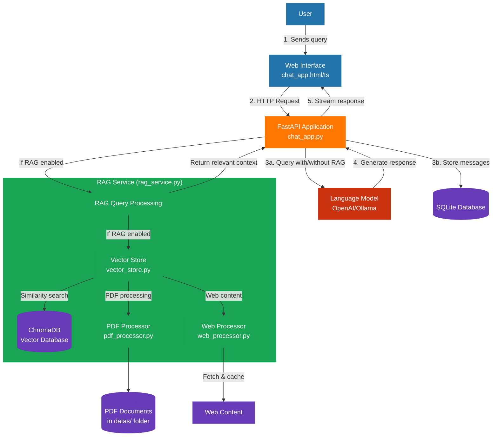

# RAG Demo Project Flow Chart

## Component Descriptions

### Frontend Components
- **chat_app.html**: HTML template for the chat interface
- **chat_app.ts**: TypeScript code for frontend functionality

### Backend Components
- **chat_app.py**: FastAPI application that handles HTTP requests and connects to the RAG service and LLM
- **SQLite Database**: Stores chat message history

### RAG Components
- **rag_service.py**: Main RAG service that coordinates retrieval and augmentation
- **vector_store.py**: Manages the vector database interactions using ChromaDB
- **pdf_processor.py**: Processes PDF documents into text chunks for the vector store
- **web_processor.py**: Fetches and processes web content for the vector store

### Data Sources
- **PDF Documents**: PDF files stored in the `datas/` folder
- **Web Content**: External web pages that can be added to the knowledge base

### LLM
- Configurable language model (OpenAI or local model like Ollama)

## Process Flow

1. User sends a query through the web interface
2. The query is sent to the backend via HTTP
3. If RAG is enabled:
   - The query is processed by the RAG service
   - Relevant documents are retrieved from the vector store
   - The query is augmented with the retrieved context
4. The augmented query (or original if RAG disabled) is sent to the LLM
5. The LLM generates a response
6. The response is streamed back to the frontend
7. Messages are stored in the SQLite database for history