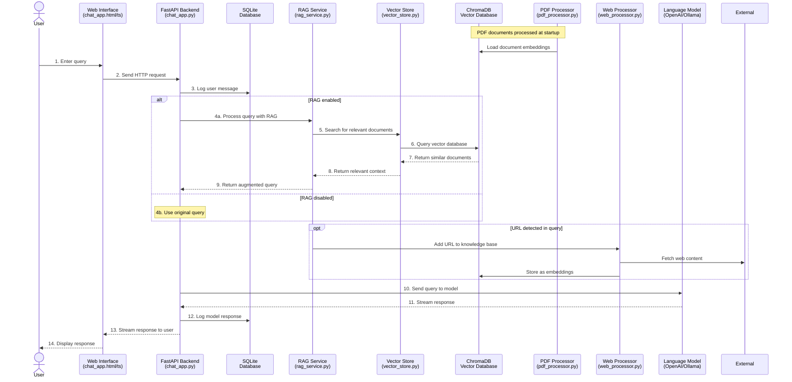

# RAG Demo Project - Sequence Diagram

## Sequence Flow Description

### Initialization
- When the application starts, PDF documents in the `datas/` folder are processed and stored in the ChromaDB vector database

### User Query Processing
1. User enters a query in the chat interface
2. The frontend sends an HTTP request to the FastAPI backend
3. The backend logs the user message in the SQLite database

### RAG Processing (if enabled)
4a. If RAG is enabled, the backend sends the query to the RAG service
5. The RAG service forwards the query to the Vector Store
6. The Vector Store queries the ChromaDB vector database
7. ChromaDB returns semantically similar documents
8. The Vector Store returns the relevant documents to the RAG service
9. The RAG service augments the original query with the retrieved context

### Web URL Processing (optional)
- If a URL is detected in the query, the RAG service extracts it
- The Web Processor fetches the content from the URL
- The content is processed and stored in the ChromaDB vector database

### Response Generation
10. The backend sends the query (augmented or original) to the Language Model
11. The LLM generates a response and streams it back
12. The backend logs the model response in the SQLite database
13. The response is streamed to the frontend
14. The frontend displays the response to the user